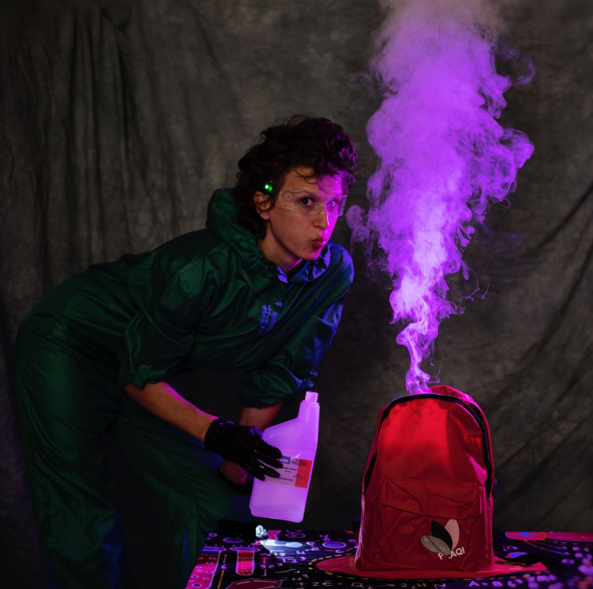
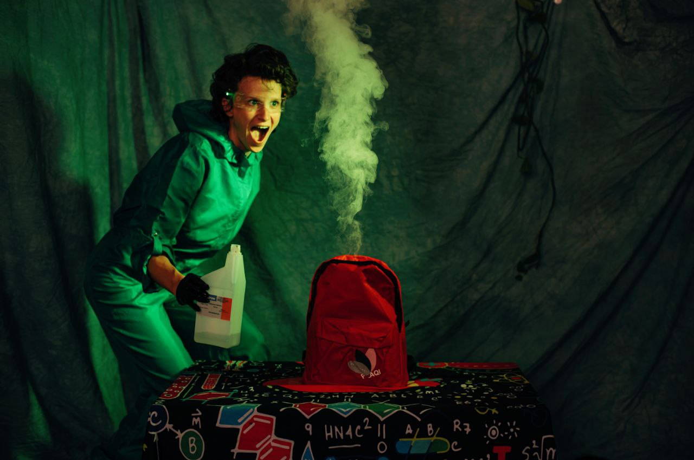
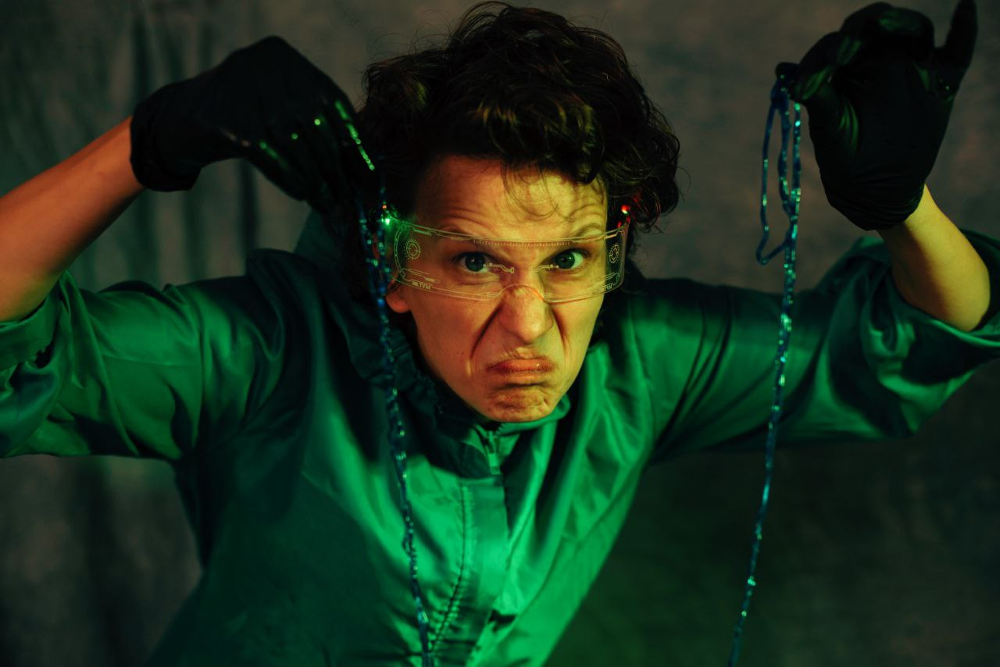
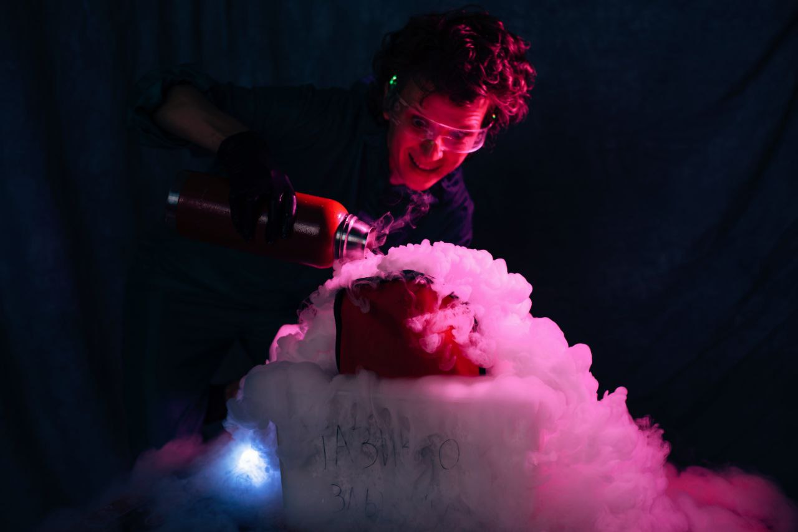
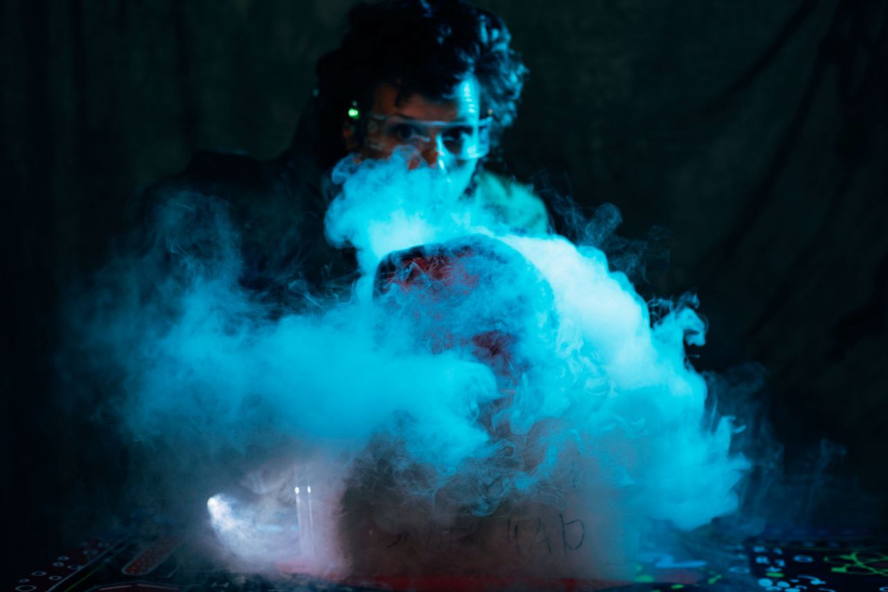
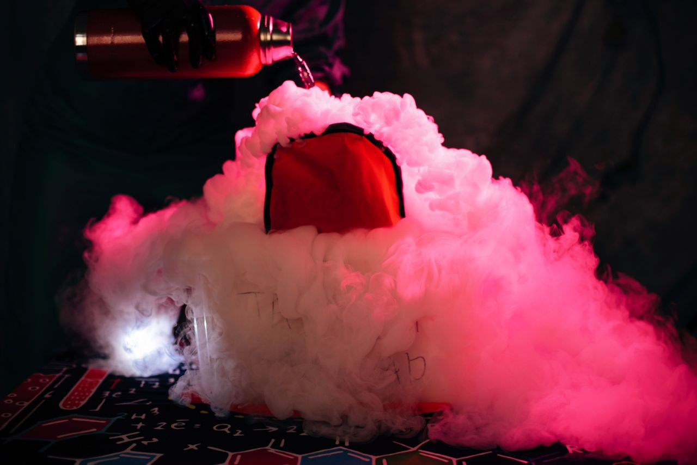
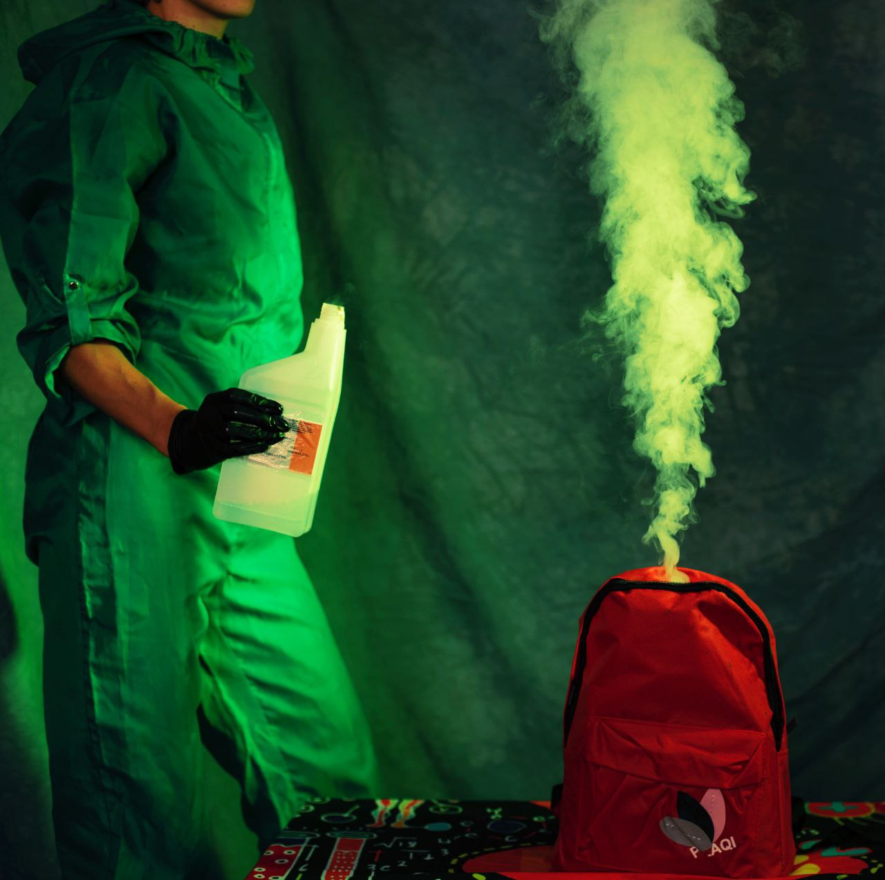

import imageChelseaHagon from '@/images/team/chelsea-hagon.jpg'

export const article = {
  createdAt: '2024-09-12',
  title: 'Промофото к обновленному спектаклю "Собирали мы рюкзак"',
  description:
    'К перезапуску нашего спектакля вместе с Алисой Чемодановой искали визуальные образы',
  author: {
    name: 'Светална',
    role: 'Безумный профессор',
    image: { src: imageChelseaHagon },
  },
}

export const metadata = {
  title: article.title,
  description: article.description,
}

