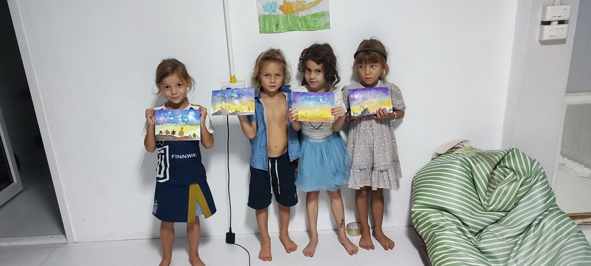
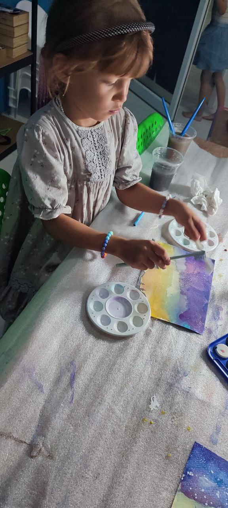

import imageChelseaHagon from '@/images/team/chelsea-hagon.jpg'

export const article = {
  createdAt: '2024-07-02',
  title: 'Космические пейзажи в горах. Вечернее занятие рисованием с Викторией',
  description:
    'Рисование развивает все полушария мозга. Завершаем наш цикл рисования акварелью',
  author: {
    name: 'Светална',
    role: 'СЕО',
    image: { src: imageChelseaHagon },
  },
}

export const metadata = {
  title: article.title,
  description: article.description,
}

## 1.Рисование акварелью - это полезно и интересно

Рисование акварелью является не только увлекательным и творческим занятием, но и полезным для развития различных навыков и качеств личности. Во-первых, акварель позволяет развивать творческое мышление и воображение. Этот вид искусства требует от художника умения видеть красоту в окружающем мире и воплощать её на бумаге или холсте. При работе с акварелью необходимо научиться видеть цвета, оттенки, их сочетания и игру света и тени.

Во-вторых, рисование акварелью способствует развитию терпения и выдержки. Этот процесс требует постоянного контроля над влажностью бумаги, нанесением краски и созданием слоев, что требует времени и терпения. Кроме того, акварель предоставляет возможность исправления ошибок, что учит терпению и настойчивости.

Третье, рисование акварелью способствует развитию мелкой моторики и координации движений. Для создания изображения с помощью акварели необходимо уметь контролировать кисть, точно дозируя количество краски и давление на бумагу. Это тренирует мелкую моторику рук и улучшает координацию движений.

Наконец, рисование акварелью является отличным способом расслабиться и отвлечься от повседневных забот. Процесс создания произведения искусства погружает в мир творчества, что помогает снять стресс и улучшить эмоциональное состояние.

Таким образом, рисование акварелью не только приносит удовольствие и радость, но и способствует развитию различных аспектов личности, таких как творческое мышление, терпение, моторика и эмоциональное благополучие.

## 2. Используем разнве техники

Использование различных техник в рисовании добавляет разнообразия и интереса к процессу создания искусства. Разнообразие техник позволяет художнику выразить свою индивидуальность, экспериментировать с различными стилями и создавать уникальные произведения. Вот некоторые из наиболее распространенных техник и их особенности:

Акварельная техника: В акварельном рисовании используется тонкая прозрачная краска, которая создает эффект легкости и прозрачности. Часто применяются техники мокрого на мокрое (нанесение краски на влажную бумагу), мокрого на сухое (нанесение краски на сухую бумагу), а также использование маскирующей жидкости для сохранения белых участков.

Масляная техника: Масляные краски обладают насыщенными цветами и позволяют создавать произведения с богатой текстурой. Эта техника часто используется для создания крупных, выразительных картин с использованием различных методов нанесения краски, таких как нанесение краски толстыми мазками или техника "глазурь".

Акриловая техника: Акриловые краски обладают быстрым временем высыхания и могут быть использованы на различных поверхностях, включая холст, дерево, бумагу и т.д. Эта техника позволяет создавать яркие, насыщенные картины с использованием различных методов нанесения краски, таких как наложение слоев, смешивание цветов и использование текстурных материалов.

Графическая техника: Включает в себя использование различных графических материалов, таких как карандаши, уголь, мел и т.д. Эта техника часто используется для создания черно-белых или монохромных произведений искусства, а также для создания контуров и деталей в комбинации с другими материалами.

Каждая из этих техник имеет свои особенности и возможности для самовыражения художника, поэтому экспериментирование с разными методами может привести к уникальным и интересным результатам.

## 3. Учим работать с цветом

При работе с цветом при создании космических сцен следует учитывать следующие принципы:

1. **Выбор палитры**: Определите основные цвета, которые вы хотите использовать для изображения космоса, например, глубокий синий для темных областей, фиолетовый и розовый для галактических туманностей, а также белый и желтый для звезд.

2. **Слои и переходы**: Создайте глубину и объем, наращивая цвета постепенно и создавая плавные переходы от одного цвета к другому. Это поможет создать ощущение пространства и глубины.

3. **Детали и текстуры**: Добавьте детали, такие как звезды, галактики, планеты и космические облака, используя яркие точки и линии для создания контраста и интересных текстур.

4. **Эффекты освещения**: Используйте свет и тени, чтобы создать эффекты освещения и добавить реализма к вашему изображению космоса. Это поможет подчеркнуть формы и контуры объектов.

5. **Эксперименты с необычными цветами**: В космосе можно использовать необычные цвета, такие как фиолетовый, розовый, зеленый и т. д., Чтобы создать атмосферные и захватывающие эффекты.

В целом, работа с цветом при создании космических сцен требует экспериментов, творчества и внимания к деталям, чтобы создать удивительные и захватывающие произведения искусства.

